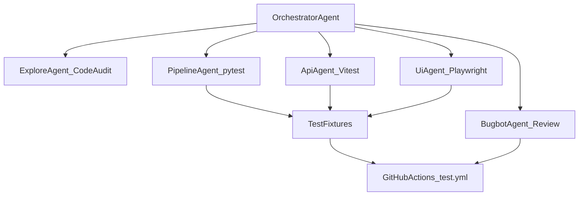

# Multi-Agent Testing Guide for KovaView

This document describes how to run KovaView's multi-agent testing workflow using Cursor Cloud Agent subagents.

## Architecture



## Subagent Roles

| Subagent | Scope | Commands | Deliverable |
|----------|-------|----------|-------------|
| **explore** | Code audit, find untested paths | Read-only scan of `pipeline/`, `src/app/api/`, `src/components/` | Coverage gap report |
| **generalPurpose (pipeline)** | Run + extend pytest | `python3 -m pytest pipeline/tests -v` | Pass/fail + new compute tests |
| **generalPurpose (api)** | Run + extend Vitest | `npm test` | Pass/fail + route handler tests |
| **computerUse** | Manual UI verification | Start dev server, navigate pages | Screen recording + bug list |
| **bugbot** | Review diff after tests | Run on branch changes | P0/P1 issue list |

## Parallel Launch Pattern

### Turn 1 (parallel)

Launch these subagents simultaneously:

```
explore:
  "Map all testable surfaces in KovaView; list P0 coverage gaps in pipeline compute,
   API routes, and UI pages."

generalPurpose (pipeline):
  "Run `python3 -m pytest pipeline/tests -v`. Fix any failures. Add tests for
   uncovered compute functions if gaps are found."

generalPurpose (api):
  "Run `npm test`. Fix any failures. Ensure all 7 API routes under src/app/api/
   have at least one happy-path and one error test."
```

### Turn 2 (after unit tests green)

```
computerUse:
  "Start `npm run dev`, smoke-test dashboard (/), screener (/screener),
   fundamentals (/fundamentals), pharma (/pharma), earnings-news (/earnings-news).
   Verify nav links, theme toggle, and no console errors."

bugbot:
  "Review branch changes. Diff: branch changes. Report P0/P1 issues in test
   infrastructure and any production code touched."
```

### Turn 3 (synthesis)

The orchestrator:

1. Merges subagent findings into a single report
2. Ensures CI workflow (`.github/workflows/test.yml`) is green
3. Opens or updates the PR with test results summary

## Running Tests Locally

### Python pipeline

```bash
pip install -r pipeline/requirements.txt
python3 -m pytest pipeline/tests -v
```

### Next.js API

```bash
npm install
npm test
```

### E2E (Playwright)

```bash
npm install
npx playwright install chromium
npm run dev   # in separate terminal
npm run test:e2e
```

## Test Coverage by Layer

### Pipeline (pytest)

- **Unit:** `trend_radar` signal math, `f_score` Piotroski criteria, `pharma_signals` rules
- **Integration:** DAG smoke test mirroring `.github/workflows/nightly-pipeline.yml`
- **Location:** `pipeline/tests/`

### API (Vitest)

| Route | Tests |
|-------|-------|
| `/api/screener` | Filters, limit cap, error handling |
| `/api/summary` | Breadth stats, stale detection |
| `/api/fundamentals` | Row flattening, sector list |
| `/api/fundamentals/[ticker]` | Ticker validation, report trends |
| `/api/pharma` | Signal summary, invalid ticker |
| `/api/earnings-news` | Earnings + news payload |
| `/api/ticker/[ticker]` | Detail payload, 404/500 paths |

- **Location:** `src/app/api/__tests__/`

### UI (Playwright)

- Dashboard, screener, fundamentals, pharma, earnings-news pages load
- **Location:** `e2e/`

## Success Criteria

| Layer | Green condition |
|-------|-----------------|
| Pipeline unit | `pytest pipeline/tests` passes |
| API | `npm test` passes; all 7 routes covered |
| UI smoke | Playwright e2e passes (or computerUse confirms pages load) |
| Review | bugbot reports no unresolved P0 issues |
| CI | `test.yml` green on PR branch |

## CI Integration

Tests run automatically on push and pull_request via `.github/workflows/test.yml`:

- **python-tests** — pytest on Python 3.12
- **frontend-tests** — Vitest via `npm test`

Subscribe to CI results after pushing using the `cursor-subscriptions` MCP `subscribe_github_ci` tool.
