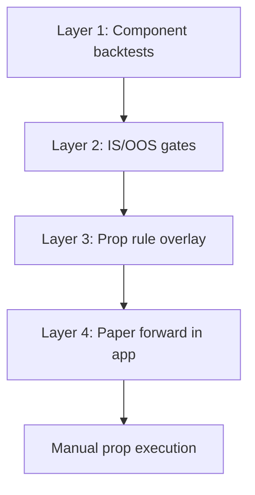

# Leveraging KovaView edge for prop-firm trading

Research playbook: where the terminal’s **real edge** lives, how to **backtest** it honestly, how to **validate** before size, and how to **overlay prop-firm rules** (FTMO-style swing, etc.). The app does **not** connect to prop platforms — execution stays manual or via your own bridge.

Not investment advice.

---

## 1. What “edge” means in this codebase

KovaView is an **EOD US equity swing** stack. Edge is not a single indicator — it is **layered, gated systematic process**:

| Layer | Role | Production surface |
|-------|------|-------------------|
| **Market regime** | Hard gate for *new* long risk (SPY ≥ SMA200 + vol not in top quartile) | `market_regime.py`, Loop skips, radar backtest `--require-regime` |
| **Universe quality** | Rank, convergence, ADX, KAMA, entry timing vetoes | `/screener`, Trend Radar |
| **Entry** | Breakout + volume (Loop) or TEMA 9/99/199 trigger (Cash) | `/loop`, `/cash` |
| **Size** | ATR-based risk % (Loop 1% / 2N, TEMA 2% of slot @ 2.5 ATR, alerts 1.25%) | `atr_risk.py`, `portfolio_loop.py`, `perps_math.py` |
| **Exit** | State decay, MACD close (TEMA), SMA20 wide trail (alerts) | `trail_exit.py`, `SWING_STRATEGY.md` |

**What backtests say today** (see `docs/SWING_STRATEGY.md`):

- **KAMA / regime** — OOS useful as **risk filter**, not pure alpha vs buy-and-hold in recent bull.
- **Radar alerts** — Best sample uses **regime + too_late veto + ATR stop + sma20_trail** (~57% win, ~+1.4% avg/trade in 2023→2026 sample).
- **TEMA breadth** — Production uses **3L + 3S** on `/cash`. Any wider basket (e.g. top-10) needs its own **IS-rank / OOS-gate** research before prop size; do not scale slot count without that step.

Prop firms care about **drawdown path and daily loss**, not Sharpe alone. A strategy with positive expectancy but fat daily tails can fail challenges even when CAGR looks fine.

---

## 2. Prop-firm fit (conceptual)

Typical **swing** accounts allow overnight/weekend holds; many offer **US names as CFDs** (symbol mapping required). KovaView signals are built on **US cash EOD closes** (Yahoo/Stooq) — align entries with **your platform’s session and symbol suffix**.

| KovaView module | Prop fit | Notes |
|-----------------|----------|--------|
| **TEMA `/cash` (TEMA-only)** | **High** for swing | 3 long + 3 short max, MACD close, 2.5 ATR stop — low churn, EOD-friendly |
| **Loop `/loop`** | **High** | Long-only, max 8 names, 8% open heat — matches “don’t overtrade” |
| **Screener + manual** | **High** | Discretionary filter on top of systematic ranks |
| **Radar + digest** | **Medium** | Event-driven; backtest before sizing |
| **ORB `/orb`** | **Low** unless you day-trade the challenge | US intraday; different rules than swing hold |
| **Carver sleeve** | **Medium** | Vol-target; scale down for prop leverage limits |

**Manual workflow (no API):**

1. After US EOD (post pipeline): read **`/cash`** (TEMA-only) or **`/loop`**.
2. Copy **side, stop, shares** → rescale from paper `$100k` to **challenge balance**.
3. Place orders on MT5/cTrader; attach stops from the desk.
4. Respect firm **daily loss / max loss / min days** (not enforced in app).

---

## 3. Validation stack (do all four before prop size)



### Layer 1 — Component backtests (research modules)

| Question | Harness | Command |
|----------|---------|---------|
| TEMA 9/99/199 + MACD | `tema_backtest.py` | `PYTHONPATH=. python -m pipeline.research.tema_backtest` |
| TEMA IS/OOS per ticker | `tema_backtest.py` | Extend tickers in a notebook; rank on IS, test on OOS before widening the book |
| KAMA / regime stability | `kama_backtest.py` | `PYTHONPATH=. python -m pipeline.research.kama_backtest --tickers SPY,QQQ,AAPL,...` |
| Alert-style trades | `radar_alert_backtest.py` | See `SWING_STRATEGY.md` § Radar alert |
| Signal matrix | `radar_signal_matrix.py` | Compare entry flags on same OOS window |

**Rules:**

- **Next-bar / next-open fills** where documented — no lookahead.
- **Do not** promote parameters from IS-only winners (`param_stability` — prefer lowest **neighbor OOS std**, not highest IS Sharpe).
- **Do not** rank on OOS then report OOS — rank on **IS**, validate on **OOS** (`tema_top10_oos` pattern).

### Layer 2 — Promotion gates

Before calling a book “prop ready”, require:

1. **OOS metrics** — Sharpe, max DD, trade count (min ~2 trades/year per name for TEMA research).
2. **Regime-conditioned performance** — re-run alerts with `--require-regime`; compare without.
3. **Concentration** — sector caps (Loop 2/sector; TEMA cluster max 2) — already in production desk.
4. **Failure mode** — recent OOS window includes chop (2023→2026); if strategy only works in 2020–2021 bull, prop daily loss will bite.

Artifact example: `pipeline/research/artifacts/kama_oos_validation.json`.

### Layer 3 — Prop challenge overlay

Convert strategy **daily returns** (from backtest equity curve or paper book marks) and run **`prop_challenge_sim.py`**:

```bash
PYTHONPATH=. python -m pipeline.research.prop_challenge_sim \
  --returns-csv my_strategy_daily_returns.csv \
  --initial 100000 \
  --daily-loss 0.05 \
  --max-loss 0.10 \
  --target 0.10
```

Defaults are **typical** 5% daily / 10% max / 10% target — **verify** against your firm’s PDF (balance vs equity, reset time, scaling).

Interpretation:

- **pass rate** on historical slices → rough frequency of completing phase 1.
- **daily_breach** → strategy tail too fat; reduce per-trade risk or skip regime-off days.
- **timeout** → target too ambitious for volatility; fewer names or lower risk %.

### Layer 4 — Paper forward

Run nightly pipeline + watch **`paper_*` tables** (`/loop`, `/cash`) for **weeks** without prop capital. Compare fills you would have taken vs EOD marks. Only then mirror on a **small** challenge.

---

## 4. Backtest recipes by prop style

### A. TEMA-only swing (matches your FTMO swing intent)

**Production book:** 3 long + 3 short, grade B+, MACD HOLD, 2.5 ATR stop (`perps_desk.py`).

**Research:**

```bash
# Single-name IS/OOS
PYTHONPATH=. python -m pipeline.research.tema_backtest

# Per-ticker validation (extend with your universe in a notebook)
PYTHONPATH=. python -m pipeline.research.tema_backtest
```

**Prop sizing:** Use `/cash` **`temaShares`** × `(your_balance / 100_000)`. TEMA sleeve is 50% of paper book — for **TEMA-only**, allocate **100%** of prop equity across at most **6** slots (3L+3S), not a wider list unless OOS gates pass.

### B. Loop breakout book (long-only, regime-aware)

**Backtest proxy:** `radar_alert_backtest` with Loop-like gates (rank ≥ 60, regime) or analyze `paper_orders` history after forward paper.

```bash
PYTHONPATH=. python -m pipeline.research.radar_alert_backtest \
  --tickers SPY,AAPL,MSFT,NVDA,JPM,XOM \
  --exit-mode sma20_trail --require-regime --skip-too-late --cooldown
```

Export daily returns from the backtest JSON if you extend the harness; feed **`prop_challenge_sim`**.

### C. Alert + discretion (email digest)

```bash
PYTHONPATH=. python -m pipeline.notify.alert_digest --dry-run
```

Validate alert count and quality; cross-check with **`radar_alert_backtest`** on the same filters (`min-rank`, `min-convergence`, `skip-too-late`).

---

## 5. Mapping paper → prop account

| Paper constant | Location | Prop adjustment |
|----------------|----------|-----------------|
| `$100,000` equity | `portfolio_loop`, `perps_desk` | `your_challenge_balance` |
| Loop risk 1% / 2N | `RISK_PCT`, `STOP_N` | Keep **ratio**; shrink if daily loss breaches sim |
| TEMA 2% of slot @ 2.5 ATR | `TEMA_RISK_PCT` | Same; respect min lot / margin |
| Max 8 Loop names | `MAX_NAMES` | Optional: lower to 4–5 for smaller accounts |
| Posture &lt; 50 no entries | Loop | Align with **no new risk** when screener defensive |

**Costs not in backtest:** CFD spread, swap, commission, slippage vs EOD close. Stress-test by subtracting **5–10 bps** per round-turn from returns before prop sim.

---

## 6. Evaluation checklist (copy before funding a challenge)

- [ ] Chosen module backtested with **regime gate** on/off documented
- [ ] **IS/OOS** or walk-forward split; no OOS peeking in selection
- [ ] **Prop sim** on daily returns with firm rule PDF parameters
- [ ] **Worst day** and **max DD** within firm limits with buffer (e.g. use 4% effective daily budget if limit is 5%)
- [ ] Symbol list **exists** on prop server
- [ ] **4+ trading days** planned (min days rule)
- [ ] Paper forward **≥ 2 weeks** on `/cash` or `/loop`
- [ ] Kill switch: stop new entries when SPY **`buys_allowed`** false (long books)

---

## 7. What to build next (product)

Not implemented today; highest leverage for prop traders:

1. **CSV export** of `/cash` and `/loop` orders (ticker, side, shares, stop).
2. **Daily return export** from paper book for one-click **`prop_challenge_sim`**.
3. **Configurable challenge profile** (JSON) per firm.
4. **Read-only** equity sync (optional, user-approved bridge).

---

## 8. Quick reference commands

```bash
python3 -m venv .venv && source .venv/bin/activate
pip install -r pipeline/requirements.txt

# Regime / KAMA OOS
PYTHONPATH=. python -m pipeline.research.kama_backtest

# Alert journal
PYTHONPATH=. python -m pipeline.research.radar_alert_backtest --require-regime --exit-mode sma20_trail

# Prop overlay (needs daily return CSV)
PYTHONPATH=. python -m pipeline.research.prop_challenge_sim --returns-csv returns.csv
```

See also: `docs/SWING_STRATEGY.md`, `notebooks/README.md`, `README.md` (Loop / Cash modules).
